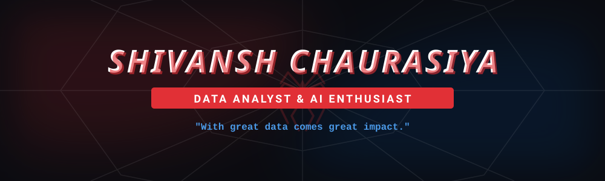
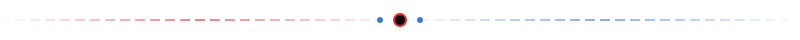

  

  <strong>🎓 MCA (Data Science) Student | 📊 Data Analytics Intern | 🚀 Aspiring Data Scientist</strong>

 

  

## 🕸️ About Me

I'm a Data Science student who enjoys turning raw data into meaningful insights and building practical AI/ML projects. I believe in learning by building — every project is another web connecting me to the next skill. 🕷️

- 🔭 **Currently working on:** Data Analytics, Machine Learning, Data Visualization, Generative AI, and Python-based projects.
- 🎓 **Education:** MCA (Data Science) Student.
- 🌍 **Based in:** Varanasi, India.
- 💬 **Ask me about:** Python, Data Analysis, Machine Learning, React, and Generative AI.

  

## 🛠️ Tech Stack & Arsenal

  <h3>Data Science & ML</h3>
  
  
  
  
  
  
  
  <h3>Web Development</h3>
  
  
  
  
  
  

 

  

## 🚀 Featured Projects

| Project | Description | Tech Stack |
|---------|-------------|------------|
| **[🫁 LungSenseAI](https://github.com/Shivansh-52)** | AI-powered respiratory sound analysis using machine learning and deep learning (CNN & BiLSTM). | `Python` `ML` `CNN` `BiLSTM` |
| **[📊 MegaMart Sales Analytics](https://github.com/Shivansh-52)** | Retail analytics project exploring sales, customer segments, and product performance. | `Python` `NumPy` `Pandas` |
| **[🕉️ Kashi](https://github.com/Shivansh-52/Kashi)** | An immersive, storytelling-focused web experience taking visitors on a spiritual journey through Varanasi. | `React` `TypeScript` `Vite` |
| **[💪 Nutrifit](https://github.com/Shivansh-52/Nutrifit)** | Fitness and nutrition tracking platform. | `JavaScript` `HTML/CSS` |

  

## 📈 Spider-Verse Activity

*Visualizing my GitHub activity. (Note: The animation below is automatically updated daily via GitHub Actions)*

  <picture>
    <source media="(prefers-color-scheme: dark)" srcset="https://raw.githubusercontent.com/Shivansh-52/Shivansh-52/output/github-contribution-grid-snake-dark.svg" />
    <source media="(prefers-color-scheme: light)" srcset="https://raw.githubusercontent.com/Shivansh-52/Shivansh-52/output/github-contribution-grid-snake.svg" />
    
  </picture>

  

## 🌐 Connect With Me

  
  
  

 

  

